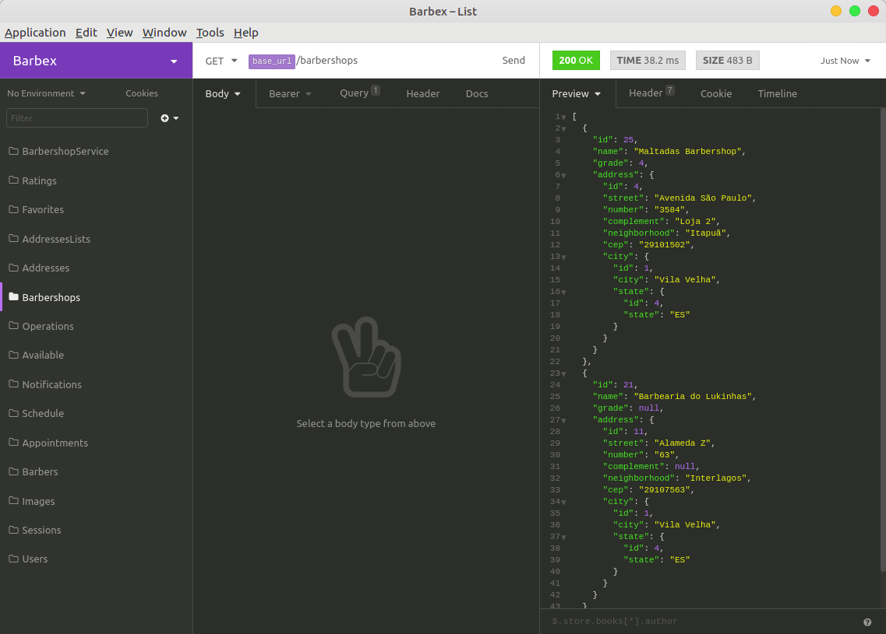

# Barbex - Backend

## Ambiente
- Ubuntu 18.04
- VS Code 1.37.0
- Node.js 10.15.3

## Ferramentas utilizadas
- Yarn
- Express
- Nodemon
- Multer
- Express-Handlebars
- Sequelize
- Mongoose
- BeeQueue (gerenciamento de filas de jobs)
- Nodemailer
- Sentry (tratamento de exceções)
- Yup
- Youch

## Bancos de dados
Utilizamos 3 imagens, de bancos diferentes, no Docker:
- PostgreSQL (armazena relacionamento entre as tabelas principais do sistema)
- MongoDB (para armazenar notificações ao usuário)
- Redis (fila para envio de emails)

## Softwares Auxiliares
- Insomnia
- Docker
- Postbird
- MongoDB Compass

## Rodando a aplicação
Primeiramente execute as imagens dos bancos de dados do Docker, por exemplo:
```bash
$ docker start redisbarbex mongobarbex postgresqlbarbex
```

Depois abra o terminal na pasta do projeto e faça:
```bash
$ yarn dev
```

## Funcionamento (Insomnia)

